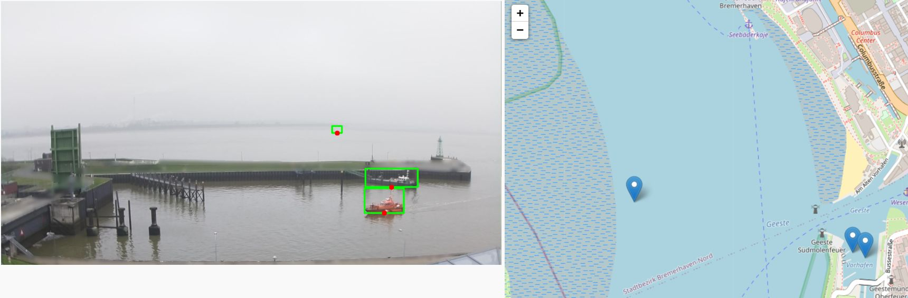
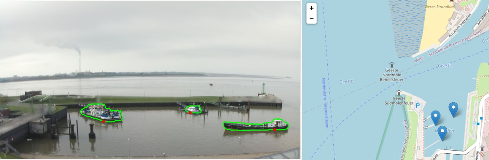
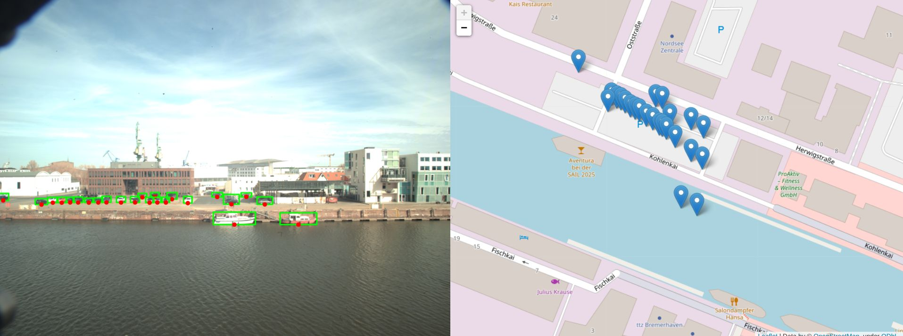
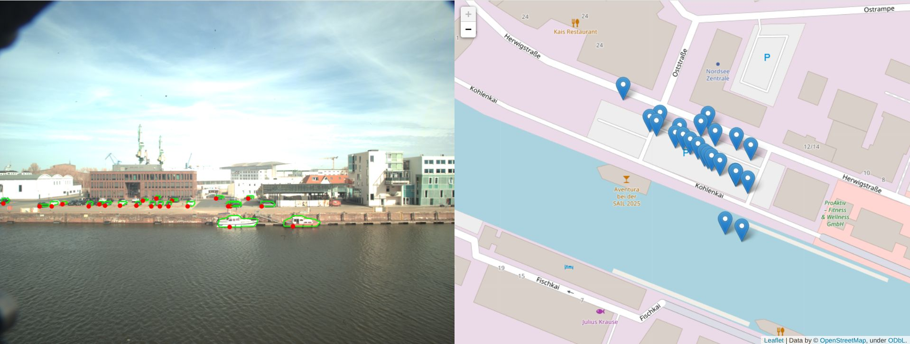

# Pix2Geo - Georeferencing Toolkit (From Pixels to Latitude and Longitude)

**pix2geo** is a dual-method pixel-to-geocoordinate georeferencing toolkit designed for maritime situational awareness and optimized for ships. It provides both homography-based and raycasting-based pipelines for converting pixel detections (from bounding boxes or segmentation masks) into latitude/longitude coordinates. This is critical for geospatial visualization of the maritime situation, enabling better awareness and monitoring.

Among the two methods, **homography** has been thoroughly validated in peer-reviewed publications and the author's work (see [📚 References](#References)). Homography works by using a set of pixel↔GPS correspondences to compute a transformation matrix (homography) that maps new image pixels directly to geocoordinates. It achieves an average georeferencing error of **18 m ± 10 m**, making it suitable for real-world maritime applications. More details and evaluation results can be found in the references section. Its main advantage is that it can be applied to any static existing camera installed at port infrastructure.
The **ShipSG** dataset [(link to download)](https://zenodo.org/records/15000157) is a benchmark for georeferencing ships from static oblique-view images. It includes pixel-to-GPS correspondences and has been used to validate the homography approach for the first time in the [Sensors 2022 paper](https://doi.org/10.3390/s22072713) and [IEEE ISPA 2023 paper](https://doi.org/10.1109/ISPA58351.2023.10279352).

On the other hand, calibrated systems with known intrinsics and extrinsics are also valuable for maritime situational awareness. **Raycasting** works by projecting 3D rays from the camera through the image detections and computing their intersection with a known ground plane. Its advantage is flexibility: it can be applied to mobile systems. For example, in the MARLIN project, the MODAR system uses a mobile optical and infrared camera, and in the MAREVIS 3D project, raycasting is used with a high-resolution mobile camera (native sensor of 50 MPix).

---

## 📂 Repository Structure

```
pix2geo/                        # Project root
├── README.md                   # This documentation
├── assets/                     # Example images & correspondence CSV
│   ├── img_095.jpg             # Sample image for homography demos (from ShipSG)
│   ├── img_306.jpg             # Sample image for homography demos (from ShipSG)
│   ├── raycast_example.jpg     # Sample image for raycast demos
│   └── shipsg_cam1_mapping.csv # Pixel↔GPS correspondences
├── configs/                    # YAML config files
│   ├── config_homography.yaml  # Homography demo settings
│   └── config_raycast.yaml     # Raycast demo settings
├── demo_homography_bbox.py     # Homography pipeline (bbox-based)
├── demo_homography_mask.py     # Homography pipeline (mask-based)
├── demo_raycast_bbox.py        # Raycasting pipeline (bbox-based)
├── demo_raycast_mask.py        # Raycasting pipeline (mask-based)
├── docs/                       # Screenshots of demos
│   ├── demo_homography_bbox.jpg
│   ├── demo_homography_mask.jpg
│   ├── demo_raycast_bbox.jpg
│   └── demo_raycast_mask.jpg
├── map_homography_bbox.html    # Generated demo outputs
├── map_homography_mask.html
├── map_bbox_with_img.html
├── map_mask_with_img.html
└── pix2geo/                    # Main Python package
    ├── __init__.py
    ├── config.py               # Load YAML/JSON configs
    ├── reference_selector.py   # Bottom-center/mode pixel selectors
    ├── homography/
    │   ├── __init__.py
    │   └── compute_homography.py
    ├── raycasting/
    │   ├── __init__.py
    │   └── raycasting_utils.py
    └── heading/                # (Future) optical-flow heading estimator
        ├── __init__.py
        └── heading_estimator.py
```

---

**Prerequisites:**

- [ultralytics](https://www.ultralytics.com/) (YOLO object detector/segmentation): `pip install ultralytics`
- (Optional) For improved maritime segmentation: ScatYOLOv8+CBAM from [https://gitlab.dlr.de/mi/marlin/scatyolov8\_cbam](https://gitlab.dlr.de/mi/marlin/scatyolov8_cbam)

---

## 🔧 Configuration

Both pipelines use a YAML config under `configs/`:

```yaml
# Pixel↔GPS correspondences
correspondences_csv: "assets/shipsg_cam1_mapping.csv"
csv:
  delimiter: ","

# Input image & detection models
image: "assets/img_306.jpg"
model:
  bbox:    "pix2geo/models/yolov8x.pt"
  segment: "pix2geo/models/yolov8x-seg.pt"

# Classes to detect (COCO indices)
classes: [8]  # e.g. 8 = boat, 2 = car
```

```yaml
image: "assets/raycast_example.jpg"
model:
  bbox:    "pix2geo/models/yolov8x.pt"
  segment: "pix2geo/models/yolov8x-seg.pt"

classes: [8]

camera:
  lat:   53.522028
  lon:   8.583522
  height: 13.21      # meters above waterline
  fov:    74.35      # horizontal field of view in deg
  pitch:  39.0
  yaw:    1.36
  roll:   0.05

plane:
  normal: [0, 0, 1]
  point:  [0, 0, 0]
```

---

## 🚀 Usage Examples

### 1. Homography & Bounding Box

```bash
python demo_homography_bbox.py configs/config_homography.yaml
```



### 2. Homography & Mask Segmentation

```bash
python demo_homography_mask.py configs/config_homography.yaml
```



### 3. Raycasting & Bounding Box

```bash
python demo_raycast_bbox.py configs/config_raycast.yaml
```



### 4. Raycasting & Mask Segmentation

```bash
python demo_raycast_mask.py configs/config_raycast.yaml
```



---

## Pixel Selection for Georeferencing

To georeference each detection, Pix2Geo selects a specific pixel that best represents the ship's location on the waterline.

### Bounding Box

- **Selection logic:** Bottom-center of the bounding box
- **Function:** [`select_bottom_center_bbox`](pix2geo/reference_selector.py)
- **Used in:** `demo_homography_bbox.py`, `demo_raycast_bbox.py`

```python
from pix2geo.reference_selector import select_bottom_center_bbox
```

### Segmentation Mask

- **Selection logic:** Bottom-most pixel with the most frequent x-coordinate (horizontal mode)
- **Function:** [`select_bottom_mode_pixel`](pix2geo/reference_selector.py)
- **Used in:** `demo_homography_mask.py`, `demo_raycast_mask.py`

```python
from pix2geo.reference_selector import select_bottom_mode_pixel
```

This strategy improves consistency and accuracy when detecting ship positions, especially in tilted or occluded views.

---


---

## Package API

You can also import core functions:

```python
from pix2geo.homography.compute_homography import compute_homography, apply_homography
from pix2geo.raycasting.raycasting_utils import calcRotationMatrix, calcCameraRay, intersectPlane
```

Use `pix2geo.config.load_config(path)` to load any YAML/JSON settings.

---

## Future Work

- **Heading estimation** via optical‑flow (`pix2geo/heading/heading_estimator.py`).
- Support for multi-camera calibration fusion.
- CLI packaging under `console_scripts` in `setup.py`.

---

## References

- Carrillo-Perez, B., Barnes, S., & Stephan, M. (2022). *Ship Segmentation and Georeferencing from Static Oblique View Images*. *Sensors*, 22(7), 2713. [https://doi.org/10.3390/s22072713](https://doi.org/10.3390/s22072713)
- Carrillo-Perez, B., Bueno, A., Barnes, S., & Stephan, M. (2023). *Improving YOLOv8 with Scattering Transform and Attention for Maritime Awareness*. In IEEE International Symposium on Signal and Image Processing and Analysis (ISPA). [https://doi.org/10.1109/ISPA58351.2023.10279352](https://doi.org/10.1109/ISPA58351.2023.10279352)
- Carrillo-Perez, B. (2024). *Real-time ship recognition and georeferencing for the improvement of maritime situational awareness*. PhD thesis, University of Bremen. [https://doi.org/10.26092/elib/3265](https://doi.org/10.26092/elib/3265)


---

## License

© 2025 DLR Institute for the Protection of Maritime Infrastructures

Software Development Level 2

